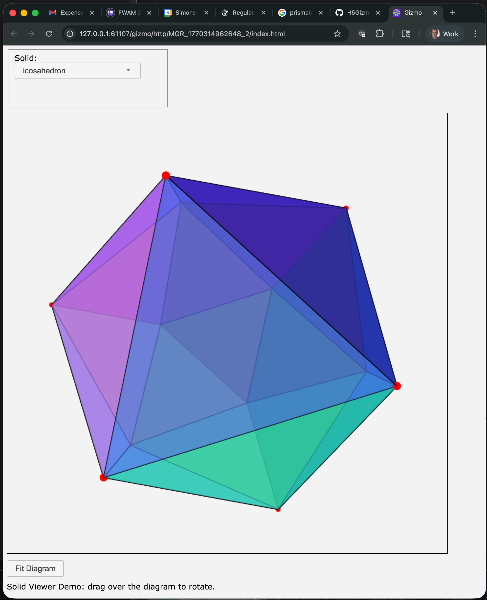

# wassilypy
Python wrapper for wassilyts browser based vector graphics in 2d and 3d



## Development

### Installing in Development Mode

To install the package in development mode with test dependencies
clone the repository from github and then run the following in the top
level `wassilypy` directory:

```bash
pip install -e ".[test]"
```

Or without test dependencies:

```bash
pip install -e .
```

### Running the examples:

The user interface generated by the examples display in a web browser
interface.  The examples do not open the interface directly but provide
a URL which opens the interface in a browser.

```bash
(test-wassily) HP07M20G6J:wassilypy awatters$ cd examples/
(test-wassily) HP07M20G6J:examples awatters$ python solids.py 

Open gizmo using link (control-click / open link)

<a href="http://127.0.0.1:49968/gizmo/http/MGR_1770316204387_2/index.html" target="_blank">Click to open</a> <br> 
 GIZMO_LINK: http://127.0.0.1:49968/gizmo/http/MGR_1770316204387_2/index.html 
```

Click or paste the URL to open the interactive interface.

### Running Tests

To run the test suite:

```bash
pytest
```
